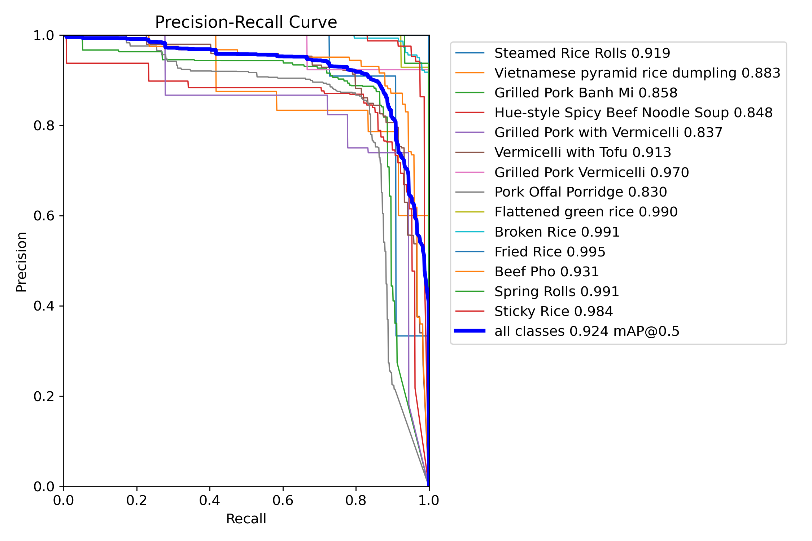

# YOLOv12 Vietnamese Food Detection

[](https://github.com/ultralytics/ultralytics)
[](https://github.com/Root0zm/Vietnamese-StreetFood-YOLO12)
[](LICENSE)

This repository contains the official PyTorch implementation and pre-trained weights for the paper:
**"A Real-Time Smart Service Framework for Vietnamese Cuisine: Integrating YOLOv12 and Semantic Synthesis for Automated Digital Menus"**.

The model is fine-tuned to detect **14 popular Vietnamese dishes** with high accuracy and real-time performance, suitable for edge deployment in smart restaurant systems.


## Performance 

The model achieves state-of-the-art performance on the collected Vietnamese Food dataset:

| Metric | Value | Note |
| :--- | :--- | :--- |
| **mAP@0.5** | **92.4%** | Excellent detection accuracy |
| **mAP@0.5:0.95**| 65.2% | Robust localization |
| **Inference Time** | **15.6 ms** | ~64 FPS on NVIDIA T4 (Real-time) |
| **Model Size** | YOLOv12m | Optimized for balance |


* Precision-Recall Curve for 14 classes.*

## 🍲 Supported Classes (14 Class)
The model can identify the following dishes:
1. Steamed Rice Rolls (Bánh cuốn)
2. Vietnamese pyramid rice dumpling (Bánh giò)
3. Grilled Pork Banh Mi (Bánh mì)
4. Hue-style Spicy Beef Noodle Soup (Bún bò Huế)
5. Grilled Pork with Vermicelli (Bún chả)
6. Vermicelli with Tofu (Bún đậu mắm tôm)
7. Grilled Pork Vermicelli (Bún thịt nướng)
8. Pork Offal Porridge (Cháo lòng)
9. Flattened green rice (Cốm)
10. Broken Rice (Cơm tấm)
11. Fried Rice (Cơm rang)
12. Beef Pho (Phở bò)
13. Spring Rolls (Gỏi cuốn)
14. Sticky Rice (Xôi)

## 🛠️ Installation & Usage

### 1. Install Dependencies
```bash
pip install ultralytics
```
### 2. Download Weights
Download directly from weights/best.pt 

### 3. Run Inference (Python)
```python
from ultralytics import YOLO
model = YOLO("weights/best.pt")
results = model.predict("path/to/your/image.jpg", save=True, conf=0.5)
results[0].show()
```
## DATASET
The dataset used for training is available in a separate repository/link: [https://github.com/Root0zm/Vietnamese-StreetFood-Dataset]

## Training Configuration

To reproduce our results, we fine-tuned the YOLOv12m model using the following hyperparameters.
The training was conducted on an NVIDIA T4 GPU for 100 epochs using the AdamW optimizer.

### Training Command (CLI)

```bash
yolo train \
model='yolo12l.pt' \
data={dataset.location}/data.yaml \
epochs=100 \
patience=10 \
batch=12 \
imgsz=640 \
optimizer='AdamW' \
lr0=1e-5 \
project='runs/train' \
name='yolov12m' \
mosaic=1.0 \
mixup=0.1 \
degrees=90 \
translate=0.1 \
scale=0.5 \
flipud=0.5

